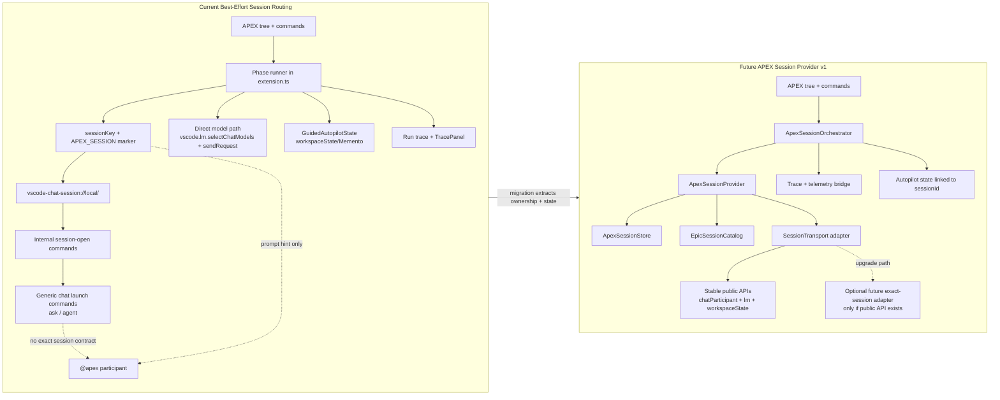

# APEX Session Provider v1

EN: This document compares the current best-effort chat-session routing with a future APEX-owned provider abstraction and audits which VS Code/Copilot surfaces are stable, best-effort, or internal.  
VI: Tài liệu này so sánh cơ chế định tuyến chat session best-effort hiện tại với một provider abstraction do APEX sở hữu trong tương lai, đồng thời kiểm kê các surface VS Code/Copilot thuộc stable, best-effort, hay internal.

## Executive Summary

The current implementation gives APEX a stable epic-scoped session identity, but not a stable session transport contract. APEX can open a native `vscode-chat-session` resource and then invoke generic chat commands, yet it cannot guarantee that the next Copilot chat request will be delivered to that exact native conversation.

`APEX Session Provider v1` should therefore be implemented first as an internal APEX-owned abstraction, not as a claimed VS Code-level native chat-session provider. The provider should own session identity, lifecycle, persistence, trace links, and command orchestration while still using the current best-effort native transport adapter underneath. If a future public API for exact session targeting appears, the transport adapter can be swapped without rewriting the business workflow.

## Why The Current Design Is Still Best-Effort

Today the extension does three useful things:

1. It creates a deterministic epic-scoped session key.
2. It maps that key to a native `vscode-chat-session://local/...` URI.
3. It opens that session before calling generic chat launch commands.

The limitation is step 3. The command payloads used to open ask-mode or agent-mode chat are not documented as an exact-session targeting API. As a result, the extension controls session intent, but not the full delivery contract.

## Architecture Diagram



## Current Ownership Map

| Concern | Current owner | Current implementation shape | Main limitation |
|---|---|---|---|
| Session identity | `PhaseSessionContext` + `buildPhaseChatSessionKey` | Stable key per epic | Identity is stable, but transport is not |
| Session transport | `buildPhaseChatSessionUri`, `tryOpenPhaseChatSession`, `tryStartCopilotChat`, `tryStartCopilotAgentChat` | Opens a native URI, then calls generic commands | Exact session targeting is not guaranteed |
| Participant follow-up | `@apex` participant | Recovers context from `APEX_SESSION` marker or last session | Prompt-marker recovery is app-level convention |
| Direct model execution | `runPhaseWithCopilotModel` | Uses `vscode.lm.selectChatModels` and `sendRequest` | Separate path from native chat session lifecycle |
| Autopilot persistence | `autopilotStateStore.ts` | `epicKey -> phase/attempt/status` in `Memento` | No explicit link to chat session ID |
| Trace and observability | `TracePanel` + run-trace history | Shows `APEX_SESSION` and launch path | Reflects chosen session intent, not guaranteed backend routing |

## Design Goal For Provider v1

`APEX Session Provider v1` is an internal architecture boundary inside the extension. It is not a claim that the extension can already register a public VS Code native chat-session provider.

### Goals

- Make one epic equal one APEX-owned session record.
- Move session lifecycle ownership out of `extension.ts` command glue.
- Persist the session record and bind it to trace and autopilot state.
- Keep the current best-effort native chat transport as an adapter.
- Allow a future exact-session adapter if VS Code/Copilot exposes a stable public surface.

### Non-goals

- Replacing GitHub Copilot Chat UI today.
- Claiming hard guarantees that stable APIs do not provide.
- Shipping a new runtime protocol in this task.

## Proposed Components

### ApexSessionOrchestrator

Command-facing orchestration layer. This is the only layer that public commands should call.

Responsibilities:

- Resolve epic and phase context.
- Request or recover an APEX session.
- Choose launch mode: direct model, ask-mode chat fallback, or agent-mode chat.
- Update trace and autopilot state after launch.

### ApexSessionProvider

Lifecycle owner for epic-scoped sessions.

Responsibilities:

- Create or recover the session record for an epic.
- Rebind the current phase when the epic advances.
- Expose current session metadata for chat handoff, trace, and resume flows.
- Delegate actual opening/submission to the transport adapter.

### ApexSessionStore

Persistence boundary around `workspaceState` or another store.

Responsibilities:

- `epicKey -> sessionId` lookup.
- `sessionId -> session record` lookup.
- Record state transitions and last launch metadata.
- Preserve backward compatibility while current flows still rely on prompt markers.

### SessionTransport Adapter

Encapsulates how APEX reaches Copilot.

Initial adapters:

- `BestEffortNativeChatTransport`: wraps the current native `vscode-chat-session` URI and generic chat commands.
- `DirectModelTransport`: wraps the existing stable `vscode.lm` direct execution path.

Future adapter:

- `ExactSessionTransport`: only if a stable public session-targeting API becomes available.

### Trace Bridge

Normalizes provider state into trace entries.

Responsibilities:

- Attach `sessionId`, `sessionKey`, launch mode, fallback reason, and transport stability label.
- Make it obvious whether the last run used stable API or best-effort command routing.

## Proposed Interfaces

```ts
export type ApexSessionStatus =
  | 'prepared'
  | 'opened'
  | 'submitted'
  | 'waitingForAgent'
  | 'paused'
  | 'completed'
  | 'failed'
  | 'orphaned';

export type ApexTransportStability =
  | 'stable-public'
  | 'best-effort-command'
  | 'internal-unsupported';

export interface ApexSessionRecord {
  sessionId: string;
  sessionKey: string;
  epicKey: string;
  workflowId?: string;
  currentPhaseId: string;
  currentPhaseName: string;
  transportId: string;
  transportStability: ApexTransportStability;
  transportResource?: string;
  status: ApexSessionStatus;
  lastLaunchMode?: 'ask' | 'agent' | 'direct-model';
  lastFallbackReason?: string;
  createdAt: string;
  updatedAt: string;
}

export interface ApexSessionStore {
  getByEpic(epicKey: string): Promise<ApexSessionRecord | undefined>;
  getBySessionId(sessionId: string): Promise<ApexSessionRecord | undefined>;
  upsert(record: ApexSessionRecord): Promise<void>;
  delete(sessionId: string): Promise<void>;
}

export interface ApexChatLaunchPayload {
  prompt: string;
  attachFiles: readonly vscode.Uri[];
  autoSubmit: boolean;
}

export interface ApexSessionTransport {
  readonly id: string;
  readonly stability: ApexTransportStability;
  readonly supportsExactSessionTargeting: boolean;

  open(record: ApexSessionRecord): Promise<CopilotChatLaunchResult>;
  openAsk(record: ApexSessionRecord, payload: ApexChatLaunchPayload): Promise<CopilotChatLaunchResult>;
  openAgent(record: ApexSessionRecord, payload: ApexChatLaunchPayload): Promise<CopilotChatLaunchResult>;
}

export interface ApexSessionProvider {
  getOrCreate(epic: EpicStatus, phase: PhaseStatus): Promise<ApexSessionRecord>;
  bindPhase(sessionId: string, phase: PhaseStatus): Promise<ApexSessionRecord>;
  markStatus(sessionId: string, status: ApexSessionStatus, reason?: string): Promise<void>;
}

export interface ApexSessionOrchestrator {
  runPhase(session: PhaseSessionContext, options: PhaseCommandOptions): Promise<PhaseCommandResult>;
  continueInChat(session: PhaseSessionContext): Promise<void>;
  pauseAutopilot(epic: EpicStatus, phase: PhaseStatus, reason?: string): Promise<void>;
  resumeAutopilot(epic: EpicStatus, phase: PhaseStatus): Promise<GuidedAutopilotResult>;
}
```

## State Model

### Core entities

| Entity | Key | Persisted? | Purpose | Notes |
|---|---|---|---|---|
| Session record | `sessionId` | Yes | Canonical per-epic session lifecycle record | One active record per epic in v1 |
| Epic binding | `epicKey -> sessionId` | Yes | Fast recovery during rerun and resume | Replaces last-session-only fallback as primary lookup |
| Launch metadata | `sessionId + lastLaunchMode` | Yes | Explain latest ask/agent/direct-model action | Also feeds trace panel |
| Autopilot binding | `epicKey + sessionId` | Yes | Resume same session after pause | Extends current autopilot state model |
| Prompt marker | `APEX_SESSION=...` | Optional | Compatibility fallback | Remains until transport no longer needs prompt hints |

### Lifecycle transitions

| From | Event | To | Notes |
|---|---|---|---|
| none | First run for epic | `prepared` | Session record created |
| `prepared` | Native chat session opened | `opened` | Best-effort transport may stop here |
| `opened` | Ask/agent submitted | `submitted` | Exactness depends on transport |
| `submitted` | Agent requires user review | `waitingForAgent` | Manual resume path |
| any active state | User pauses autopilot | `paused` | Session stays bound to epic |
| active | Phase passed and epic advances | `prepared` | Same session record, new phase binding |
| active | Fatal transport/model failure | `failed` | Trace stores fallback reason |
| active | Session cannot be recovered after reload | `orphaned` | Recovery flow should create replacement |

## Command Surface

### Public commands retained

| Command | v1 behavior |
|---|---|
| `apexDelivery.runPhaseInCopilot` | Delegates to `ApexSessionOrchestrator.runPhase` |
| `apexDelivery.pauseGuidedAutopilot` | Marks autopilot paused and links the current `sessionId` |
| `apexDelivery.resumeGuidedAutopilot` | Recovers `sessionId` for the epic before continuing |
| `apexDelivery.openTracePanel` | Reads provider-aware trace fields |

### Internal operations introduced

| Operation | Purpose |
|---|---|
| `getOrCreate(epic, phase)` | Recover or allocate the epic-scoped session record |
| `bindPhase(sessionId, phase)` | Move the same session forward as phases advance |
| `openAsk(record, payload)` | Centralize ask-mode launch instead of direct command calls from `extension.ts` |
| `openAgent(record, payload)` | Centralize agent-mode launch and fallback handling |
| `markStatus(sessionId, status)` | Keep trace and autopilot status aligned |

## API Surface Audit

### Stable and public

The official VS Code AI extensibility docs explicitly document these surfaces:

- `contributes.chatParticipants` and `vscode.chat.createChatParticipant`
- `ChatRequest`, `ChatContext.history`, `ChatResponseStream`, follow-up providers, slash commands, and references
- `vscode.lm.selectChatModels`
- `LanguageModelChat.sendRequest`
- `vscode.lm.registerLanguageModelChatProvider`
- Standard extension APIs such as `TreeView`, `WebviewPanel`, `Memento`, command registration, and `OutputChannel`

### Public but orthogonal

`vscode.lm.registerLanguageModelChatProvider` is public and stable, but it registers a language-model provider for VS Code. It does not provide a public API for owning a GitHub Copilot Chat session, restoring a session by resource, or hard-targeting the next user-visible Copilot chat turn.

### Not documented as stable session-control APIs

The official chat and language-model docs do not describe any stable public API for:

- registering a custom chat session provider
- opening an exact native chat session by resource and then targeting the next prompt to it with a public contract
- hard-setting the active Copilot agent for a native chat session
- hard-setting the selected native Copilot chat model for a session or turn

### Matrix

| Surface | Current APEX usage | Status | Limitation | Migration implication |
|---|---|---|---|---|
| `contributes.chatParticipants` + `vscode.chat.createChatParticipant` | `@apex` follow-up participant | Stable/public | Participant only owns its mentioned turns | Keep; provider v1 should feed it session state |
| `ChatContext.history`, references, markdown/progress/button stream output | Traceable participant responses | Stable/public | Applies inside participant scope only | Keep for follow-up and trace UX |
| `vscode.lm.selectChatModels` + `LanguageModelChat.sendRequest` | Direct model run and artifact proposal | Stable/public | No native chat-session ownership | Keep as direct-model transport |
| `context.languageModelAccessInformation.canSendRequest` | Permission gate before direct model use | Stable/public | Only gates direct model access | Keep as part of transport selection |
| `workspaceState` / `Memento` | Trace and autopilot persistence | Stable/public | Current schema does not model session lifecycle explicitly | Extend with provider store |
| `workbench.action.chat.open` with ask/agent payload | Native chat launch | Command-based best-effort | Payload contract for exact session routing is not documented as stable AI extensibility API | Wrap in `BestEffortNativeChatTransport` |
| `workbench.action.chat.openAgent`, `workbench.action.chat.openAsk` | Additional chat entrypoints | Command-based best-effort | Useful fallback only; no exact session contract | Keep behind transport adapter |
| `workbench.action.chat.openSessionInEditorGroup` and `...openSessionInNewEditorGroup` | Open native session by resource | Internal/unsupported | Not part of official stable AI extension docs | Treat as optional internal adapter, never as hard guarantee |
| `vscode-chat-session://local/...` URI scheme | Epic-scoped native session resource | Internal/unsupported | Scheme shape is observable, but not documented public contract for third-party ownership | Keep as adapter detail only |
| `APEX_SESSION=...` prompt marker | Compatibility hint across turns | App-level convention | Model may ignore it; not transport control | Retain only as fallback while exact session targeting is unavailable |
| Hard-binding native Copilot chat agent or model per message | Desired future behavior | Unsupported on stable public API | No documented stable API for exact agent/model selection in native chat UI | Document as future-only, not v1 scope |

## Migration Path

### Phase 0: Current baseline

Keep current behavior unchanged while documenting the extraction targets.

### Phase 1: Extract transport boundaries

Move these concerns behind a dedicated adapter:

- `buildPhaseChatSessionUri`
- `tryOpenPhaseChatSession`
- `tryStartCopilotChat`
- `tryStartCopilotAgentChat`

This phase should not change user behavior.

### Phase 2: Introduce provider-owned state

Add `ApexSessionStore` and `ApexSessionProvider` as the primary owner of:

- epic to session lookup
- session status lifecycle
- launch metadata
- recovery after reload

At this point `APEX_SESSION` remains a compatibility marker, but no longer the primary state source.

### Phase 3: Bind autopilot and trace to `sessionId`

Extend the current autopilot state model to carry `sessionId` as optional first, then required after migration. Trace entries should record transport stability so maintainers can distinguish direct-model runs from best-effort native chat launches.

### Phase 4: Move the participant to provider-backed state

The `@apex` participant should first resolve provider state, then fall back to the prompt marker only for backward compatibility. This reduces dependence on prompt parsing and last-session heuristics.

### Phase 5: Optional exact-session transport

Only if VS Code or Copilot publishes a stable public API for exact session targeting, add a new `ExactSessionTransport` adapter. This adapter should replace the current internal command path without rewriting the orchestrator or provider state model.

## Recommended Decision

Build `APEX Session Provider v1` as an internal abstraction now, but do not market it as a native VS Code chat-session provider yet.

That approach gives APEX three concrete wins immediately:

1. session ownership becomes explicit and testable
2. autopilot, trace, and chat handoff share one state model
3. future exact-session support becomes a transport swap instead of a rewrite

It also avoids one bad architectural move: hard-coding more business logic into internal command paths that are not part of the stable public contract.

## Public API Verdict

### What can be built today on stable/public API?

- An APEX-owned session abstraction in extension code
- A stable `@apex` participant
- A stable direct-model path using `vscode.lm`
- Stable persistence, trace UI, and command orchestration

### What cannot be claimed on stable/public API today?

- A public custom native chat-session provider for GitHub Copilot Chat
- Exact hard-targeting of the next native Copilot chat prompt to a chosen session by stable contract
- Hard-locking the native Copilot agent or model for a given session/turn

### Practical conclusion

The right v1 is not “replace best-effort with magic.” The right v1 is “make APEX own session state even while transport remains best-effort.”